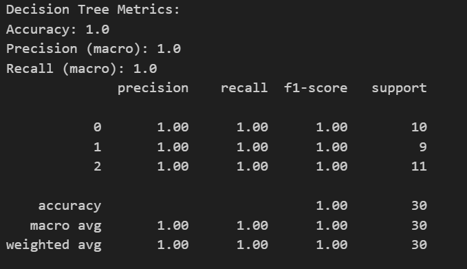
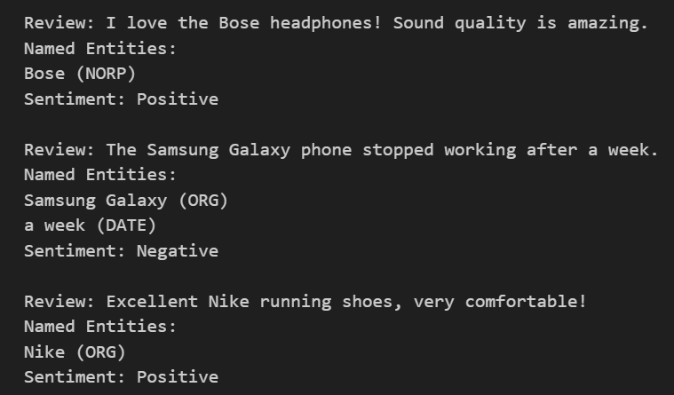

# AI_Toolkit_Explorer# AI Toolkit Explorer

This repository contains practical AI implementations using **Scikit-learn**, **TensorFlow**, **PyTorch**, and **spaCy**. The goal is to demonstrate AI skills, model evaluation, and NLP tasks.

---

## Table of Contents

1. [Project Overview](#project-overview)
2. [Practical Tasks](#practical-tasks)

   * [Classical ML: Iris Dataset](#classical-ml-iris-dataset)
   * [Deep Learning: MNIST CNN](#deep-learning-mnist-cnn)
   * [NLP: Amazon Reviews NER & Sentiment](#nlp-amazon-reviews-ner--sentiment)
3. [Screenshots](#screenshots)
4. [Theoretical Questions](#theoretical-questions)
5. [Ethical Considerations](#ethical-considerations)
6. [How to Run](#how-to-run)

---

## Project Overview

This project demonstrates practical AI tasks including:

* Classical Machine Learning using **Decision Tree Classifier** on Iris dataset
* Deep Learning using **Convolutional Neural Network (CNN)** on MNIST handwritten digits
* Natural Language Processing (NLP) using **spaCy** for Named Entity Recognition (NER) and sentiment analysis

---

## Practical Tasks

### Classical ML: Iris Dataset

* Dataset: Iris species
* Model: Decision Tree Classifier
* Metrics: Accuracy, Precision, Recall

**Example Output:**

* Accuracy: 1.0
* Precision (macro): 1.0
* Recall (macro): 1.0



### Deep Learning: MNIST CNN

* Dataset: MNIST handwritten digits
* Model: CNN using TensorFlow
* Achieved Test Accuracy: 0.9915

**Screenshot:** *Attach here the screenshot of the CNN test accuracy and sample predictions*

### NLP: Amazon Reviews NER & Sentiment

* Extracted named entities (products and brands)
* Rule-based sentiment analysis (positive/negative/neutral)



---

## Theoretical 

**Differences between TensorFlow and PyTorch**

* TensorFlow is production-oriented with static graph support and TensorFlow Serving. PyTorch is research-friendly, dynamic, and more Pythonic.
* Choose TensorFlow for deployment and large-scale production; choose PyTorch for research and rapid prototyping.

**Use cases for Jupyter Notebooks**

1. Interactive experimentation with ML/DL models.
2. Documentation and visualization of datasets and model performance.

**How spaCy enhances NLP tasks**

* Provides pre-trained pipelines for tokenization, POS tagging, NER, and dependency parsing.
* Faster and more accurate than manual string operations for large text corpora.

**Comparative Analysis: Scikit-learn vs TensorFlow**

| Feature             | Scikit-learn      | TensorFlow             |
| ------------------- | ----------------- | ---------------------- |
| Target Applications | Classical ML      | Deep Learning          |
| Ease of Use         | Beginner-friendly | Steeper learning curve |
| Community Support   | Large, mature     | Large, growing         |

---

## Ethical Considerations

* Check for dataset biases, e.g., class imbalance in Iris or demographic bias in MNIST.
* Rule-based sentiment analysis may misclassify sarcasm or subtle expressions.
* Tools like TensorFlow Fairness Indicators can help monitor model fairness.

---

## How to Run

1. Clone the repo

   ```bash
   git clone <repo_url>
   cd AI_Toolkit_Explorer
   ```
2. Activate virtual environment

   ```bash
   source venv/bin/activate
   ```
3. Run Jupyter Notebook

   ```bash
   jupyter notebook AI_Toolkit_Explorer.ipynb
   ```
4. Execute cells sequentially to see outputs and visualizations.

---

